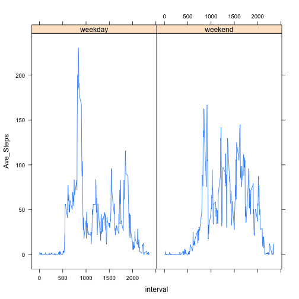

## Loading and preprocessing the data
Load required xts, lubridate packages and generate the data file

```r
        library(xts, quietly=TRUE, warn.conflicts=FALSE)
        library(lubridate, quietly=TRUE)
        library(dplyr)
        library(lattice)
        zipFileName <- "activity.zip"
        fileName <- "activity.csv"
        unzip(zipFileName)
        actDataSet <- read.csv(fileName)
        actDataSet$ts <- ymd(actDataSet$date)
```


## 1. What is mean total number of steps taken per day?
We generate the required data and ignore NA values

```r
        # break down by day
        ep <- endpoints(actDataSet$ts, on="days",k=1)
        # create data set required to answer question 1
        q1DataSet <- actDataSet[ep, c("date")]
        q1DataSet$TotalSteps <- period.apply(actDataSet$steps, ep, sum)
        meanTotalSteps <- format(mean(q1DataSet$TotalSteps, na.rm=T), digits=1)
        medianTotalSteps <- format(median(q1DataSet$TotalSteps, na.rm=T), digits=1)
```
Now let's plot a histogram of the Question 1 data set

```r
        hist(q1DataSet$TotalSteps, main="Histogram of Total Steps per Day", xlab="Total Steps")
```

 

#### Some additional calculations, both ignoring any NA values:
* The **mean** of total number of steps taken per day is **10766**.
* The **median** of total number of steps is **10765**.

## 2. What is the average daily activity pattern?

```r
        # Prepare data set suitable for graphing using dplyr
        avgDailyPattern <- actDataSet %>%  
        group_by(interval) %>% 
        summarize(Average_Steps = mean(steps, na.rm=TRUE))
        with(avgDailyPattern, 
             plot(Average_Steps ~ interval, type="l", 
                  main="Average Steps vs Interval", xlab="Time of Day", ylab="Average Steps"))
```

 

```r
        # Calculate highest average number of steps in an interval
        ha <- as.integer(avgDailyPattern[avgDailyPattern$Average_Steps == max(avgDailyPattern$Average_Steps),"interval"][1][1])
```

The time interval with highest average number of steps acrors all days is **835**.


## 3. Imputing missing values

The total number of **NA** values in the activity data set is **2304**. That is about
**13** percent.

Our strategy for imputing missing values is to fill them with the average value for the number of steps in each interval across all days that we obtained ignoring NAs.


```r
        # Merge with the data set containing average daily set per interval
        mergedActDataSet <- merge(actDataSet, avgDailyPattern, by = "interval", all = TRUE)
        naIdx <- is.na(mergedActDataSet$steps)
        # Replace NAs with average values
        mergedActDataSet$steps[naIdx] <- mergedActDataSet$Average_Steps[naIdx]
        # Order on Date, Interval
        orderedIdx <- with(mergedActDataSet, order(ts, as.integer(interval)))
        mergedOrderedActDataSet <- mergedActDataSet[orderedIdx,]
        # Now repeat the steps performed in Question 1 to generate data for histogram
        ep3 <- endpoints(mergedOrderedActDataSet$ts, on="days", k=1)
        # create data set for answering question 3
        q3ds <- mergedOrderedActDataSet[ep3, c("date")]
        q3ds$TotalSteps <- period.apply(mergedOrderedActDataSet$steps, ep3, sum)
        meanImpTotalSteps <- format(mean(q3ds$TotalSteps), digits=1)
        medianImpTotalSteps <- format(median(q3ds$TotalSteps), digits=1)
```

Now let's plot a histogram similar to Question 1 but of the imputed data set

```r
        hist(q3ds$TotalSteps, main="Histogram of Total Steps per Day", xlab="Total Steps")
```

 

* The **mean** of imputed total number of steps taken per day is **10766**.
* The **median** of imputed total number of steps is **10766**.

As a result of imputing NA values the mean and median did not change much. However, the frequency for most of the Total Steps buckets increased, roughly preserving the relative size between the buckets.

## 4. Are there differences in activity patterns between weekdays and weekends?

We need to factorize the data based on "weekend" and "weekday" factors. We use data set whose NA values were imputed previously.


```r
        # Generate date of the week first
        mergedOrderedActDataSet$Day <- weekdays(mergedOrderedActDataSet$ts)
        # Generate True for weekdays, false otherwise
        mergedOrderedActDataSet$IsWeekDay <- mergedOrderedActDataSet$Day != "Saturday" & mergedOrderedActDataSet$Day != "Sunday"
        # Create initial factor variable, with NAs first
        mergedOrderedActDataSet$DayFactor <- factor(mergedOrderedActDataSet$IsWeekDay, c("weekday", "weekend"))
        # Now fill in the Day Factor
        mergedOrderedActDataSet$DayFactor[mergedOrderedActDataSet$IsWeekDay==TRUE] <- "weekday"
        mergedOrderedActDataSet$DayFactor[mergedOrderedActDataSet$IsWeekDay!=TRUE] <- "weekend"
```

Now let us look at the Average Steps for weekdays and weekends separately

```r
        q5 <- mergedOrderedActDataSet %>% group_by(DayFactor,interval) %>% summarize(Ave_Steps = mean(steps))
        with(q5, xyplot(Ave_Steps ~ interval | DayFactor, type="l"))
```

 

During weekdays the activity peaks in the morning but then is lower through the day than on weekends.
